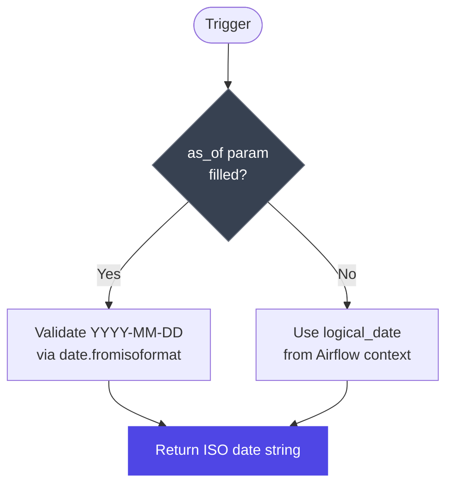
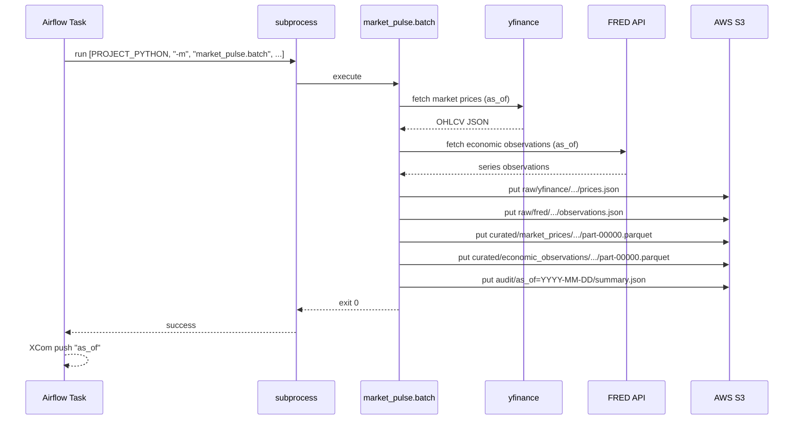
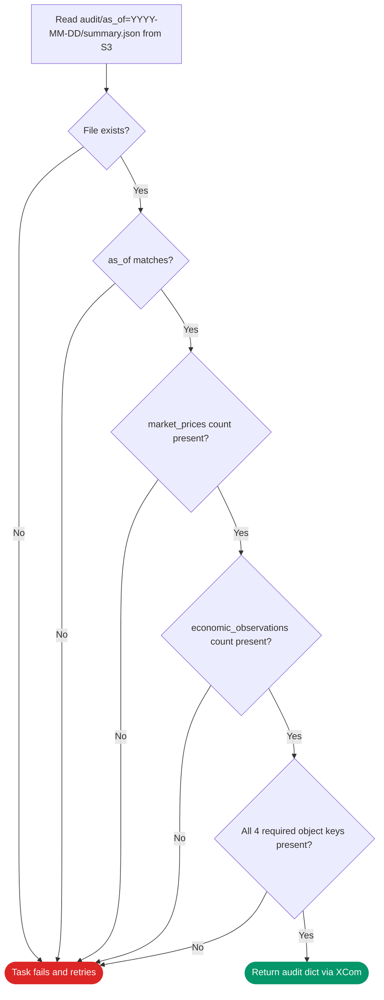
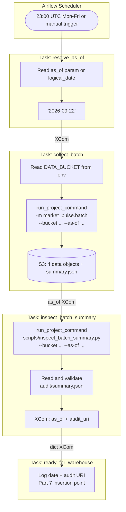
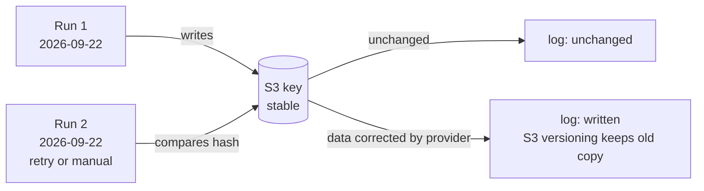
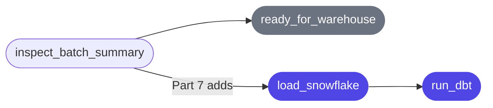

# Airflow DAG: `market_pulse_daily`

> **File:** [`airflow/dags/market_pulse_daily.py`](file:///Users/dwikynator/learning/data-engineering/market-pulse/airflow/dags/market_pulse_daily.py)
> **Part of:** MarketPulse — Part 6 (Airflow Orchestration)

---

## Overview

The DAG orchestrates the **bounded batch path** of the MarketPulse pipeline. It schedules the existing batch collector (Part 3), verifies the S3 audit summary, and exposes a clear handoff point for the warehouse loader (Part 7).


Each task is a pure Python function decorated with `@task` (Airflow's **TaskFlow API**). Return values are automatically stored in **XCom** and passed as arguments to the next task — Airflow infers the dependency from that call graph.

---

## `run_project_command` — The Helper

```python
PROJECT_ROOT   = "/opt/project"
PROJECT_PYTHON = "/opt/project/.venv/bin/python"

def run_project_command(arguments: list[str]) -> None:
    subprocess.run(
        [PROJECT_PYTHON, *arguments],
        cwd=PROJECT_ROOT,
        check=True,
    )
```

### Why use `subprocess` instead of a direct import?

The Airflow container runs two completely separate Python environments:

```
/usr/local/lib/python3.12/   ← Airflow's environment
/opt/project/.venv/          ← MarketPulse application environment
```

| Concern              | Direct import                                         | subprocess (chosen)                                |
| -------------------- | ----------------------------------------------------- | -------------------------------------------------- |
| Dependency isolation | ❌ Merges both envs — version conflicts possible      | ✅ Each env stays fully independent                |
| Airflow stability    | ❌ Adding yfinance, boto3, pandas could break Airflow | ✅ Airflow packages untouched                      |
| Dev/prod parity      | ❌ Different path in each env                         | ✅ Same entry point as manual runs                 |
| Error visibility     | ❌ Tracebacks would need extra capturing              | ✅ `stdout`/`stderr` flow straight to the task log |

### Why `check=True`?

`check=True` raises `subprocess.CalledProcessError` when the command exits with a non-zero status code. Airflow intercepts that exception, marks the task **failed**, and applies the configured retry policy — exactly the same failure/retry lifecycle as any other task exception.

### What appears in the task log?

Because `stdout` and `stderr` are **not** redirected, every `print()` call and traceback from the project code flows directly into the Airflow task log. No extra log-capture plumbing is needed.

---

## DAG Config — `market_pulse_daily`

```python
@dag(
    dag_id      = "market_pulse_daily",
    schedule    = "0 23 * * 1-5",
    start_date  = pendulum.datetime(2026, 1, 1, tz="UTC"),
    catchup     = False,
    max_active_runs = 1,
    params      = { "as_of": Param(...) },
    tags        = ["market-pulse", "batch"],
)
```

### Schedule — `"0 23 * * 1-5"`

```
  ┌─ minute  (0)
  │ ┌─ hour   (23 = 23:00 UTC)
  │ │ ┌─ day-of-month (*)
  │ │ │ ┌─ month (*)
  │ │ │ │ ┌─ day-of-week (1-5 = Mon–Fri)
  0 23 * * 1-5
```

| Choice           | Reason                                                                                      |
| ---------------- | ------------------------------------------------------------------------------------------- |
| **23:00 UTC**    | Late in the UTC day — US and European markets have closed and published final figures       |
| **Mon–Fri only** | Equity markets don't trade on weekends; collecting Saturday/Sunday would return no new data |
| **Not midnight** | Gives providers a margin before the calendar rolls over                                     |

> **Airflow's `logical_date`** for a scheduled run is the _start_ of the interval — so Tuesday's 23:00 run carries Monday's logical date. The `resolve_as_of` task makes this explicit so every downstream step shares the exact same partition date.

### `catchup=False`

When a DAG is first enabled, Airflow would normally create a separate run for **every** missed interval since `start_date`. With `catchup=False`:

- Enabling the DAG creates only the **next** scheduled run.
- Historical runs are available on demand via `airflow backfill create` — intentional, not accidental.
- Free provider APIs (yfinance, FRED) are not suddenly hit with months of backfill requests.

### `max_active_runs=1`

Only one DAG run may execute at a time. This means:

- Backfill runs are processed **sequentially** (one date at a time), making progress easy to observe.
- No two runs can race to write the same S3 keys simultaneously.
- Provider rate limits are respected — a single run already makes multiple HTTP calls.

### `params` — the `as_of` Param

```python
"as_of": Param(
    "",                              # default: empty → use logical_date
    type="string",
    pattern=r"^$|^\d{4}-\d{2}-\d{2}$",  # empty OR YYYY-MM-DD
    description="Optional YYYY-MM-DD date. Leave empty for the run's logical date.",
)
```



| Trigger type      | `as_of` param | Date used                 |
| ----------------- | ------------- | ------------------------- |
| Scheduled run     | _(empty)_     | DAG's `logical_date`      |
| Backfill run      | _(empty)_     | Each run's `logical_date` |
| Manual correction | `2026-09-22`  | `2026-09-22`              |

The regex accepts an empty string **or** a visible ISO date shape. Impossible dates like `2026-02-31` pass the regex but are caught inside `resolve_as_of` by `date.fromisoformat`.

---

## Task 1 — `resolve_as_of`

```python
@task
def resolve_as_of() -> str:
    context = get_current_context()
    requested = context["params"]["as_of"]
    if requested:
        return date.fromisoformat(requested).isoformat()
    return context["logical_date"].date().isoformat()
```

### What it does

Reads the `as_of` Param from the trigger context and returns a canonical **ISO date string** (`"YYYY-MM-DD"`). This is the single source of truth for the partition date used by all downstream tasks.

### Why it's the first task (not a DAG-level variable)

If the date were computed at DAG-parse time (e.g., as a module-level variable), it would be fixed when Airflow imports the file — potentially many hours before the run actually executes. By computing it inside a task:

- Backfill runs each get their **own** logical date independently.
- The Airflow scheduler can parse the DAG file quickly with no side effects.
- Manual overrides via `Param` work without any special-casing outside the DAG.

### XCom output

Returns a plain `str` — JSON-serialisable, safe to store in XCom and pass to `collect_batch`.

---

## Task 2 — `collect_batch`

```python
@task(
    retries=2,
    retry_delay=timedelta(minutes=2),
    execution_timeout=timedelta(minutes=30),
)
def collect_batch(as_of: str) -> str:
    bucket = os.environ.get("DATA_BUCKET")
    ...
    run_project_command(["-m", "market_pulse.batch", "--bucket", bucket, "--as-of", as_of])
    return as_of
```

### What it does

Runs `python -m market_pulse.batch` — the **exact same entry point** used during manual development in Part 3. Airflow-specific logic never leaks into the collector or storage code.



### S3 objects written

| S3 key pattern                                                      | Content                           |
| ------------------------------------------------------------------- | --------------------------------- |
| `raw/yfinance/as_of=YYYY-MM-DD/prices.json`                         | Raw yfinance JSON (canonical)     |
| `raw/fred/as_of=YYYY-MM-DD/observations.json`                       | Raw FRED API response (canonical) |
| `curated/market_prices/as_of=YYYY-MM-DD/part-00000.parquet`         | Normalised market prices          |
| `curated/economic_observations/as_of=YYYY-MM-DD/part-00000.parquet` | Normalised economic series        |
| `audit/as_of=YYYY-MM-DD/summary.json`                               | Completion marker (written last)  |

### Retry config rationale

| Setting             | Value    | Reason                                                                                                                |
| ------------------- | -------- | --------------------------------------------------------------------------------------------------------------------- |
| `retries`           | `2`      | Covers transient provider failures (yfinance, FRED) or temporary S3 throttling                                        |
| `retry_delay`       | `2 min`  | Gives the upstream system time to recover before the next attempt                                                     |
| `execution_timeout` | `30 min` | Safety ceiling — a normal run takes a few minutes; this prevents a hung HTTP call from blocking the slot indefinitely |

### Idempotency

The batch command writes **stable, date-partitioned S3 keys** and compares content hashes before uploading. Running the same `as_of` date twice is safe:

```
First run:  market raw: written   → s3://bucket/raw/yfinance/as_of=2026-09-22/...
Second run: market raw: unchanged → s3://bucket/raw/yfinance/as_of=2026-09-22/...
```

If a provider corrected its historical data between runs, the object is genuinely overwritten and S3 versioning captures the previous version.

---

## Task 3 — `inspect_batch_summary`

```python
@task(
    retries=2,
    retry_delay=timedelta(minutes=2),
    execution_timeout=timedelta(minutes=10),
)
def inspect_batch_summary(as_of: str) -> dict[str, str]:
    ...
    run_project_command(["scripts/inspect_batch_summary.py", "--bucket", bucket, "--as-of", as_of])
    return {"as_of": as_of, "audit_uri": f"s3://{bucket}/audit/as_of={as_of}/summary.json"}
```

### What it does

Reads and validates the `audit/as_of=YYYY-MM-DD/summary.json` file that `collect_batch` wrote last. It is the designed **completion boundary** — the summary only exists after all four data objects are safely stored.



### Why the summary and not a raw S3 list?

| Approach                         | What it verifies           | Problem                                                                                        |
| -------------------------------- | -------------------------- | ---------------------------------------------------------------------------------------------- |
| List S3 objects                  | Objects exist              | Doesn't confirm _all_ objects or their correctness                                             |
| Read individual Parquet files    | Data content               | Couples the task to internal storage logic                                                     |
| **Read `summary.json`** (chosen) | Designed completion marker | Confirms all 4 objects succeeded, provides counts and paths, is the same interface Part 7 uses |

### XCom output

Returns a small `dict[str, str]` — intentionally minimal. **Parquet bytes, DataFrames, and full source responses are never passed through XCom.** S3 is the data boundary between tasks.

```json
{
  "as_of": "2026-09-22",
  "audit_uri": "s3://bucket/audit/as_of=2026-09-22/summary.json"
}
```

### Retry config rationale

| Setting             | Value    | Reason                                                                              |
| ------------------- | -------- | ----------------------------------------------------------------------------------- |
| `retries`           | `2`      | Handles transient S3 throttling or eventual-consistency delay after `collect_batch` |
| `retry_delay`       | `2 min`  | Time for S3 to propagate the new audit object before retrying                       |
| `execution_timeout` | `10 min` | Generous ceiling for a small JSON read that typically completes in under a second   |

---

## Task 4 — `ready_for_warehouse`

```python
@task
def ready_for_warehouse(summary: dict[str, str]) -> None:
    print(f"Ready for Part 7: {summary['as_of']}")
    print(f"Completion marker: {summary['audit_uri']}")
```

### What it does

Logs the partition date and the audit URI that Part 7 will use to drive Snowflake loading and dbt transformations. It is an **explicit handoff point**, not a stub.

### Why not just skip it?

| Option                                    | Problem                                                                                            |
| ----------------------------------------- | -------------------------------------------------------------------------------------------------- |
| End at `inspect_batch_summary`            | No visible downstream boundary — hard to see where Part 7 connects in the graph                    |
| Add fake Snowflake/dbt calls              | Pretends an implementation exists before it does                                                   |
| **`ready_for_warehouse` marker** (chosen) | Honest: names exactly what is ready, shows in the graph, leaves a clear insertion point for Part 7 |

### No retries

This task performs no I/O. It only logs two strings. A failure here would be a Python bug in the task itself, not a transient infrastructure issue — retries would not help.

---

## Full Data Flow



---

## XCom Values Summary

| From task               | To task                 | Value                                                     |
| ----------------------- | ----------------------- | --------------------------------------------------------- |
| `resolve_as_of`         | `collect_batch`         | `"2026-09-22"` (str)                                      |
| `collect_batch`         | `inspect_batch_summary` | `"2026-09-22"` (str)                                      |
| `inspect_batch_summary` | `ready_for_warehouse`   | `{"as_of": "2026-09-22", "audit_uri": "s3://..."}` (dict) |

> [!NOTE]
> Only small scalar values (a date string and a two-key dict) flow through XCom. Heavy data stays in S3 — Parquet files and raw JSON are never passed between tasks.

---

## Rerun Safety

The DAG is designed to be **safely rerunnable** for any given date:



- Same date → same S3 keys (stable partitioning).
- Content unchanged → object not overwritten (hash comparison).
- Provider correction → object updated, versioning preserves history.

---

## Part 7 Connection Point



Part 7 will add real Snowflake loading and dbt tasks after `inspect_batch_summary` and remove (or rename) `ready_for_warehouse` once those implementations exist.
