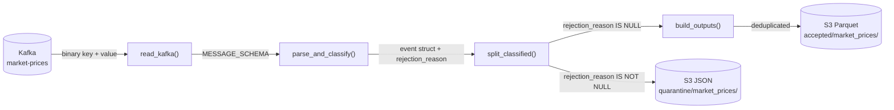
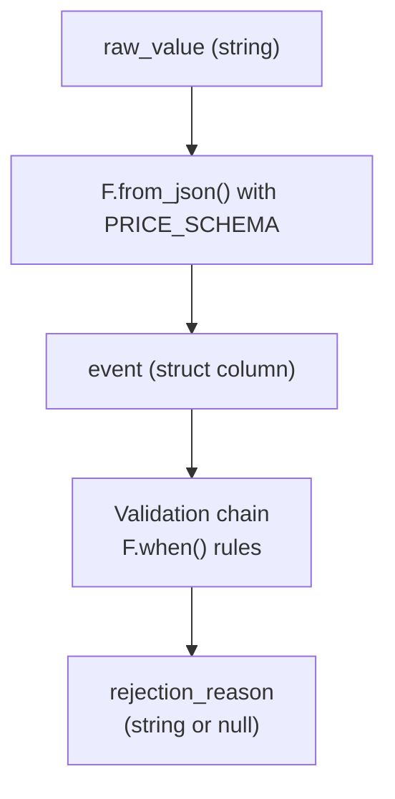
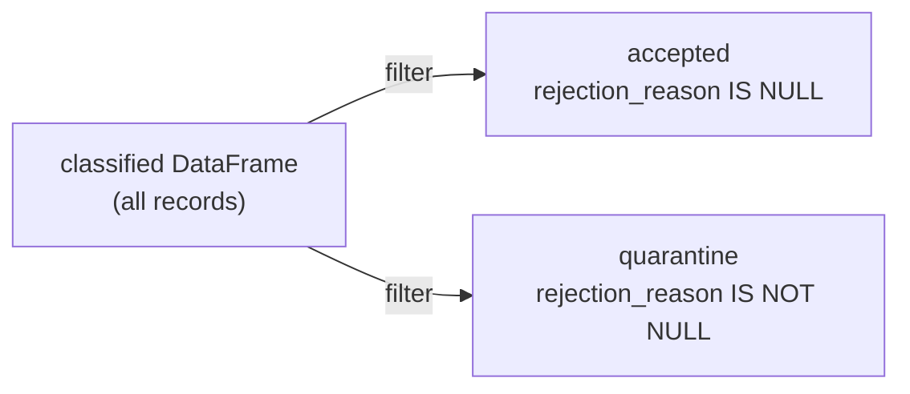
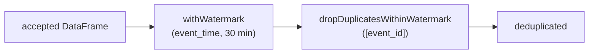

# Spark Streaming — How It Works in MarketPulse

> **Source file:** [`src/market_pulse/spark_prices.py`](../src/market_pulse/spark_prices.py)

---

## Pipeline Overview



Every incoming Kafka message travels through four functions. No data is processed until `start_queries()` is called — all prior steps build a lazy execution plan.

---

## Step-by-Step

### 1. `read_kafka()` — Pull from Kafka

Kafka delivers messages as raw bytes. Spark exposes them as a fixed set of columns:

| Kafka column | Type      | Renamed to             |
| ------------ | --------- | ---------------------- |
| `key`        | binary    | `message_key` (string) |
| `value`      | binary    | `raw_value` (string)   |
| `topic`      | string    | `kafka_topic`          |
| `partition`  | int       | `kafka_partition`      |
| `offset`     | long      | `kafka_offset`         |
| `timestamp`  | timestamp | `kafka_timestamp`      |

The result is a **lazy streaming DataFrame** — nothing is read from Kafka yet.

---

### 2. `parse_and_classify()` — Parse JSON and tag each record

Two things happen here:



**Parsing — why `PERMISSIVE` mode?**

`F.from_json()` supports three parse modes. We chose `PERMISSIVE`:

| Mode            | Behaviour on bad JSON                                                     | Trade-off                                                 |
| --------------- | ------------------------------------------------------------------------- | --------------------------------------------------------- |
| `PERMISSIVE` ✅ | Keeps the raw text in `_corrupt_record`; sets wrong-type fields to `null` | Bad records are visible and routable to quarantine        |
| `DROPMALFORMED` | Silently discards the row                                                 | The bad event disappears — no evidence, no alerting       |
| `FAILFAST`      | Throws an exception and kills the stream                                  | One bad message from one symbol stops the entire pipeline |

`DROPMALFORMED` would hide producer bugs. `FAILFAST` would let a single malformed message stop all six symbol streams. `PERMISSIVE` keeps the evidence and lets the validation chain decide what to do with it.

**Validation rules (in order — first match wins):**

| #   | Rule                          | Reason code                |
| --- | ----------------------------- | -------------------------- |
| 1   | `_corrupt_record` is not null | `MALFORMED_JSON`           |
| 2   | Any required field is null    | `MISSING_OR_INVALID_FIELD` |
| 3   | `message_key != event.symbol` | `KEY_SYMBOL_MISMATCH`      |
| 4   | `interval != "5m"`            | `UNSUPPORTED_INTERVAL`     |
| 5   | `source != "yfinance"`        | `UNSUPPORTED_SOURCE`       |
| 6   | Any OHLC price ≤ 0            | `NON_POSITIVE_PRICE`       |
| 7   | `volume < 0`                  | `NEGATIVE_VOLUME`          |
| 8   | OHLC relationship invalid     | `INVALID_OHLC`             |

Rules 1–2 catch structural problems; rules 3–8 catch business-logic problems. Checking structural issues first means a record with both a corrupt JSON body and an invalid OHLC is labelled `MALFORMED_JSON`, not `INVALID_OHLC` — the most actionable root cause comes first.

Records that pass every rule get `rejection_reason = null` — meaning accepted.

---

### 3. `split_classified()` — Route to accepted or quarantine



**Accepted columns** — typed business fields + Kafka lineage (topic, partition, offset) + a derived `event_date` column used for Parquet partitioning.

**Quarantine columns** — `raw_value` is kept as-is (flattening an invalid record would destroy the evidence), plus `rejection_reason` and `quarantined_at` (processing time).

---

### 4. `build_outputs()` — Deduplicate valid records



**Why watermark + deduplication?**

Kafka producers use **at-least-once delivery**: when a message is not acknowledged in time, the producer retries and sends the same event again. Without deduplication, the same AAPL candle at 08:00 could land in the accepted output twice.

`dropDuplicatesWithinWatermark(["event_id"])` keeps only the first record per `event_id` — but Spark cannot keep every `event_id` ever seen in memory forever. The watermark bounds how long state is retained.

**Concrete example — what actually happens across micro-batches:**

Assume the watermark delay is 30 minutes and `event_id = "aapl-0800"`.

```
Timeline of event_time values Spark has seen:

  08:05  → max event_time = 08:05  → watermark boundary = 07:35
  08:10  → max event_time = 08:10  → watermark boundary = 07:40
  08:15  → max event_time = 08:15  → watermark boundary = 07:45
  ...
  08:35  → max event_time = 08:35  → watermark boundary = 08:05
```

| Micro-batch | Event arrives                          | event_time | Watermark boundary | Result                                                              |
| ----------- | -------------------------------------- | ---------- | ------------------ | ------------------------------------------------------------------- |
| 1           | `aapl-0800` (first)                    | 08:00      | 07:35              | ✅ Emitted; state saved                                             |
| 2           | `aapl-0800` (retry)                    | 08:00      | 07:40              | 🚫 Duplicate — dropped (state still alive)                          |
| 3           | `aapl-0755` (late, 10 min)             | 07:55      | 07:45              | ✅ Accepted — within boundary                                       |
| 4           | Watermark advances to 08:05            | —          | 08:05              | 🗑 State for 07:35–08:05 events evicted                             |
| 5           | `aapl-0800` (another retry, very late) | 08:00      | 08:10              | ⚠️ Passes through — state already gone; no duplicate emitted either |

Row 5 shows the **trade-off**: once state is evicted Spark cannot guarantee deduplication for that `event_id` anymore. The 30-minute window means a retry that shows up more than 30 minutes after the watermark has advanced past its event_time is outside the guarantee. This is acceptable here because the producer is a short-lived Python script that retries within seconds.

**Why `dropDuplicatesWithinWatermark` instead of `dropDuplicates`?**

`dropDuplicates` (without watermark) would keep **all** seen `event_id` values in memory forever. For a stream that runs continuously, that is an unbounded memory leak — the state grows without limit until the job crashes. `dropDuplicatesWithinWatermark` is the bounded alternative.

**Why 30 minutes?**

It is not a finance requirement. It is large enough to accept the 10-minute out-of-order event used in the controlled demo (`publish_spark_demo.py`) while still bounding state. A production pipeline with a guaranteed short retry window could use a smaller value.

> **Order matters:** `withWatermark` must be called before `dropDuplicatesWithinWatermark`. Spark uses the watermark declaration to determine when state can be safely evicted. Without it, Spark would not know the boundary and would reject the stateful operation.

---

### 5. `start_queries()` — Write to S3

Two independent streaming write queries run concurrently:

| Query                       | Format  | Why                                          |
| --------------------------- | ------- | -------------------------------------------- |
| `accepted-market-prices`    | Parquet | Columnar; efficient for analytical reads     |
| `quarantined-market-prices` | JSON    | Human-readable; easy to inspect bad payloads |

Accepted records are **partitioned by `event_date`** so a downstream reader can skip entire date folders when filtering.

Each query has its own **checkpoint directory**. Sharing a checkpoint between two queries would corrupt their independent offset and deduplication histories.

---

## Output Layout

Real S3 listing from a demo run (4 micro-batches):

```
streaming/
├── accepted/
│   └── market_prices/
│       ├── _spark_metadata/          ← streaming metadata (see below)
│       │   ├── 0                     ← batch 0 manifest (empty — no rows committed)
│       │   ├── 1                     ← batch 1 manifest (lists the Parquet files written)
│       │   ├── 2
│       │   └── 3
│       └── event_date=2026-09-25/    ← Hive-style partition directory
│           ├── part-00001-9c1ff122-....c000.snappy.parquet  (4934 bytes)
│           ├── part-00002-50769701-....c000.snappy.parquet  (4935 bytes)
│           └── part-00002-ebcdd8b6-....c000.snappy.parquet  (4934 bytes)
├── quarantine/
│   └── market_prices/
│       ├── _spark_metadata/
│       │   ├── 0 … 3
│       ├── part-00000-3b67e9db-....-c000.json   (0 bytes — batch had no quarantine rows)
│       ├── part-00000-82fb305a-....-c000.json   (251 bytes — has quarantine records)
│       ├── part-00000-91f63709-....-c000.json   (0 bytes)
│       └── part-00000-fe080fbf-....-c000.json   (0 bytes)
└── checkpoints/
    ├── accepted-market-prices/
    └── quarantined-market-prices/
```

> **Why 0-byte JSON files?** Every trigger interval Spark writes a file per active partition, even when a micro-batch produced no quarantine rows. The file exists to mark that the batch ran and committed — not that data was written.

---

## Output File Naming

Real accepted files from the S3 demo run:

```
event_date=2026-09-25/part-00001-9c1ff122-e5b2-4ada-9d98-2e4862811af3.c000.snappy.parquet
event_date=2026-09-25/part-00002-50769701-e133-40bb-b1c3-0450fa330dd5.c000.snappy.parquet
event_date=2026-09-25/part-00002-ebcdd8b6-63e6-492a-991a-1f750e7bcfd6.c000.snappy.parquet
```

Notice two files with `part-00002` but different UUIDs — they came from two different micro-batches that both happened to produce data in partition 2. The UUID is what prevents them from overwriting each other.

No code in this project controls the full filename — Spark generates it internally to guarantee atomicity. Here is what each segment means and where it comes from:

```
part  - 00001 - 9c1ff122-e5b2-4ada-9d98-2e4862811af3 . c000 . snappy . parquet
 │       │       │                                       │      │        │
 │       │       │                                       │      │        └─ format → .format("parquet") in start_queries()
 │       │       │                                       │      └─ compression codec → Snappy (Spark default; not set in code)
 │       │       │                                       └─ task attempt number (c000 = first attempt; c001 if task retried)
 │       │       └─ UUID generated per micro-batch write job → makes files from different batches unique
 │       └─ partition index → controlled by spark.sql.shuffle.partitions = 3 in create_spark_session()
 └─ fixed prefix Spark uses for all data output files
```

### What controls what

| Segment    | Controlled by                    | Code location                                                      |
| ---------- | -------------------------------- | ------------------------------------------------------------------ |
| `part-`    | Fixed Spark convention           | —                                                                  |
| `00001`    | `spark.sql.shuffle.partitions`   | `create_spark_session()` — set to `3`, so you get `00000`–`00002`  |
| UUID       | Per-write-job ID Spark generates | — (internal, guarantees uniqueness across micro-batches)           |
| `.c000`    | Task attempt counter             | — (increments if the task fails and retries)                       |
| `.snappy`  | Parquet compression codec        | Spark default; override with `spark.sql.parquet.compression.codec` |
| `.parquet` | Output format                    | `.format("parquet")` in `start_queries()`                          |

### Why Spark owns the name

Spark writes to a `_temporary/` staging directory first, then atomically renames to the final path only after the checkpoint commits the micro-batch as successful. If you could specify the filename, a partial write from a failed task could silently overwrite a good file from a previous batch.

### Quarantine JSON files

Real quarantine files from the S3 demo run:

```
part-00000-3b67e9db-75d2-472c-bc5f-d9ea2600c5f8-c000.json   (0 bytes)
part-00000-82fb305a-4a33-4ffb-8a60-1c35edddc0b3-c000.json   (251 bytes — has quarantine rows)
part-00000-91f63709-91c8-4d83-b97b-085be7cf8a3e-c000.json   (0 bytes)
part-00000-fe080fbf-0ff0-4b67-8cec-d68b45408059-c000.json   (0 bytes)
```

All four files are `part-00000` because quarantine data fits in a single partition (`shuffle.partitions=3` but only one partition had data). The UUID still changes per batch, and 0-byte files appear for batches that produced no quarantine rows.

---

## Checkpoints

A checkpoint stores the complete progress and state of a streaming query so it can resume exactly where it left off. Here is the real directory tree for `accepted-market-prices/` from the demo run:

```
checkpoints/accepted-market-prices/
├── metadata                          ← query identity (name, ID)
├── commits/
│   ├── 0                             ← "batch 0 committed to sink"
│   ├── 1
│   ├── 2
│   └── 3
├── offsets/
│   ├── 0                             ← Kafka offsets Spark will read for batch 0
│   ├── 1
│   ├── 2
│   └── 3
├── sources/
│   └── 0/
│       └── 0                         ← initial Kafka partition metadata
└── state/
    └── 0/                            ← operator 0 = dropDuplicatesWithinWatermark
        ├── _metadata/
        │   ├── metadata              ← state schema version info
        │   └── schema               ← the schema of the state rows (event_id + watermark)
        ├── 0/                        ← state shard for shuffle partition 0
        │   ├── 1.delta               ← delta file written after batch 1
        │   ├── 2.delta
        │   ├── 3.delta
        │   └── 4.delta
        ├── 1/                        ← state shard for shuffle partition 1
        │   ├── 1.delta
        │   ├── 2.delta  (142 bytes — has event_id entries)
        │   ├── 3.delta
        │   └── 4.delta
        └── 2/                        ← state shard for shuffle partition 2
            ├── 1.delta
            ├── 2.delta  (142 bytes)
            ├── 3.delta  (142 bytes)
            └── 4.delta
```

### What each subfolder stores

**`metadata`** — a small JSON file written once when the query first starts. Contains the query name and a generated UUID. Spark uses this to detect if you accidentally point two different queries at the same checkpoint directory.

**`offsets/`** — one file per batch. Each file records the Kafka topic/partition offsets that Spark _plans to read_ for that batch. Written before reading begins. If the job crashes after writing `offsets/2` but before writing `commits/2`, Spark knows on restart that batch 2 was started but not committed and replays it.

**`commits/`** — one file per batch. Written _after_ the sink write succeeds. The pair `offsets/N` + `commits/N` together mean batch N is fully done. If `offsets/N` exists but `commits/N` does not, Spark replays batch N on restart.

**`sources/`** — stores initial Kafka partition discovery metadata (which partitions exist, earliest offsets). Written once at startup.

**`state/`** — the deduplication state. One subdirectory per shuffle partition (matching `spark.sql.shuffle.partitions = 3` → partitions 0, 1, 2). Each partition's state is written as a series of `.delta` files — incremental updates rather than rewriting the full state each batch. Larger `.delta` files (142 bytes vs 46 bytes in the demo) indicate batches where new `event_id` entries were added or existing entries were evicted by the watermark.

**`_spark_metadata/`** (under the data directories, not the checkpoint) — Spark's streaming file-sink log. Lists which Parquet/JSON files were committed per batch so a `spark.read` on the directory skips files from incomplete batches.

### The offsets/commits two-phase protocol

```
Batch N lifecycle:
  1. Write offsets/N      ← "I plan to read up to these Kafka offsets"
  2. Read from Kafka
  3. Run transformations
  4. Write output files
  5. Write commits/N      ← "output is committed; batch N is done"
  6. Advance to batch N+1

Crash between step 1 and 5:
  → On restart: offsets/N exists, commits/N missing
  → Spark replays batch N from the same Kafka offsets
  → Output files from the failed attempt are ignored (not in _spark_metadata)
```

**Concrete restart example from this demo:**

After 4 batches the checkpoint records:

```
offsets/0  offsets/1  offsets/2  offsets/3   ← all planned
commits/0  commits/1  commits/2  commits/3   ← all committed
```

On restart Spark reads the latest `offsets/3` to know where to resume (the next batch will start from the offsets immediately after what batch 3 read). `startingOffsets=latest` in the code is ignored because the checkpoint already has the answer.

**Never delete checkpoints unless you intentionally want to replay from the beginning.**

---

## Spark Session Configuration

### `master` — `local[2]`

| Option              | Behaviour             | Why not chosen                                              |
| ------------------- | --------------------- | ----------------------------------------------------------- |
| `local[2]` ✅       | Two local JVM threads | Enough for two concurrent streaming queries on a laptop     |
| `local[1]`          | Single thread         | The two queries would share one thread and block each other |
| `local[*]`          | Use all CPU cores     | Wastes cores on a dev machine; doesn't reflect production   |
| `spark://host:7077` | Real Spark cluster    | Overkill for a portfolio demo; requires a running cluster   |

### `spark.sql.session.timeZone` — `UTC`

Spark defaults to the JVM's system time zone. On a developer machine in `Asia/Jakarta` (UTC+7), a `TimestampType` value that was stored as `2026-09-23T08:00:00Z` could be displayed or compared as `2026-09-23T15:00:00` — 7 hours off. Pinning to UTC makes timestamps unambiguous regardless of where the job runs.

### `spark.sql.shuffle.partitions` — `3`

| Value           | Trade-off                                                                                       |
| --------------- | ----------------------------------------------------------------------------------------------- |
| `200` (default) | Right for large clusters with wide data; creates 200 tiny files locally — slow and wasteful     |
| `3` ✅          | Matches the 3 Kafka topic partitions; each shuffle produces 3 output files — manageable locally |
| `1`             | Works but removes parallelism; one thread handles everything                                    |

This setting controls how many partitions Spark creates **after** a shuffle operation (e.g. groupBy, join). With only 6 symbols and micro-batches of a few dozen rows, the Spark default of 200 would create 200 near-empty task slots per batch.

### `spark.hadoop.fs.s3a.aws.credentials.provider` — `ProfileCredentialsProvider`

| Option                               | Behaviour                                              | Why not chosen                                                                |
| ------------------------------------ | ------------------------------------------------------ | ----------------------------------------------------------------------------- |
| `ProfileCredentialsProvider` ✅      | Reads `~/.aws/credentials` using `AWS_PROFILE` env var | No secrets in code or Spark arguments                                         |
| `SimpleAWSCredentialsProvider`       | Pass `access_key` + `secret_key` directly in config    | Keys end up in logs, checkpoint metadata, and process listings                |
| `InstanceProfileCredentialsProvider` | Uses the EC2 instance IAM role automatically           | Correct for production on EC2/ECS; not available on a laptop                  |
| Default chain                        | Tries multiple sources in order                        | Works but is implicit; `ProfileCredentialsProvider` makes the source explicit |

---

## Schema Reference

### `MESSAGE_SCHEMA` — Kafka envelope

Describes the shape after `read_kafka()` renames the raw Kafka columns. Also used by the integration test to create a fake input DataFrame without a live broker.

### `PRICE_SCHEMA` — Market price event

The expected shape of the JSON payload inside `raw_value`. All fields are nullable because parsing (type coercion) and validation (null checks) are separate steps. `_corrupt_record` is a Spark convention — it is never in the original payload.

### `REQUIRED_FIELDS`

All fields from `PRICE_SCHEMA` except `adjusted_close` (optional in the `MarketPrice` model) and `_corrupt_record` (internal Spark field). A null in any of these fields triggers `MISSING_OR_INVALID_FIELD`.

---

## Micro-batch Lifecycle

Each trigger interval (default 5 seconds):

```
1. Spark checks Kafka for new messages since the last committed offset.
2. If messages exist, they form a micro-batch (a bounded DataFrame).
3. The transformation plan runs on the batch.
4. Results are written to the output sinks.
5. Kafka offsets and state are committed to the checkpoint.
6. Spark waits until the next trigger interval.
```

`awaitAnyTermination()` in `main()` blocks the driver thread during this loop. Ctrl+C breaks out of the wait; the `finally` block then stops both queries and the Spark session cleanly.
